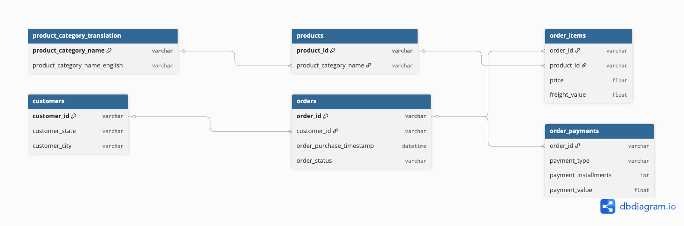
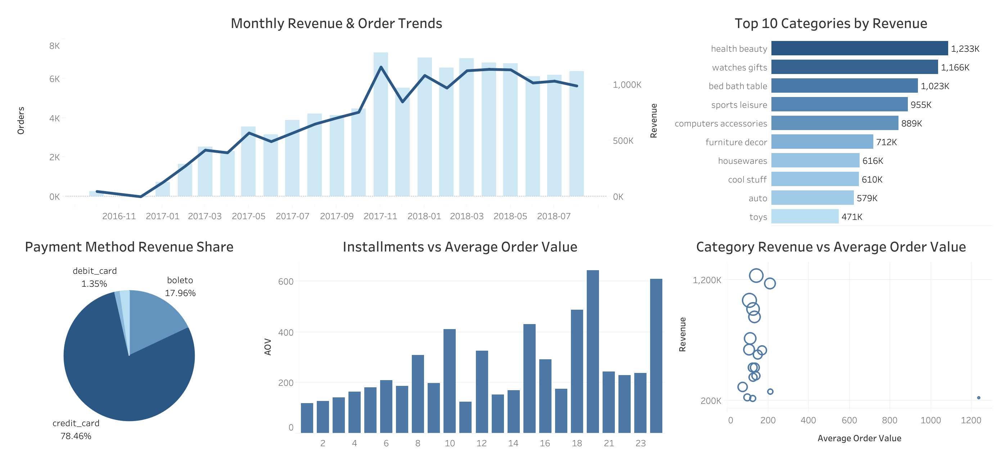

# E-commerce Order & Customer Analytics Dashboard

## Project Overview

E-commerce companies generate large amounts of transactional and customer behavior data every day. 
Analyzing this data can help businesses understand sales performance, customer purchasing behavior, and product trends to support decision-making.

This project analyzes e-commerce orders, payments, and product categories using SQL and Tableau. 
The goal is to transform raw transactional data into actionable business insights through data processing, SQL analysis, and interactive dashboard visualization.

## Tools Used
- SQL (DB Browser for SQLite)
- Tableau Public
  
## Database Schema
The dashboard was built using multiple relational tables from the [Olist e-commerce dataset](https://www.kaggle.com/datasets/olistbr/brazilian-ecommerce/data), including orders, payments, products, and customer information.

## Business Questions
1. How did revenue and order volume change over time?
2. Which product categories generated the highest revenue?
3. Which payment methods contributed most to sales?
4. How do installments affect average order value?
5. Which categories have high revenue but low order value?

## Key Insights
1. Credit cards contributed nearly 80% of total revenue.
2. Health & beauty generated the highest revenue among all categories.
3. Revenue and order volume steadily increased throughout 2017.
4. Higher installment counts were associated with larger average order values.
5. Some categories generated high revenue despite relatively lower average order value, suggesting high order frequency.

## SQL Workflow
- Cleaned and transformed raw e-commerce datasets
- Joined orders, payments, products, and customer information
- Created analytical views for analysis and Tableau visualization

## Tableau Dashboard
[View Tableau Dashboard](https://public.tableau.com/views/E-commerceOrderCustomerAnalytics/1?:language=en-US&:sid=&:redirect=auth&:display_count=n&:origin=viz_share_link)

## Dashboard Preview

